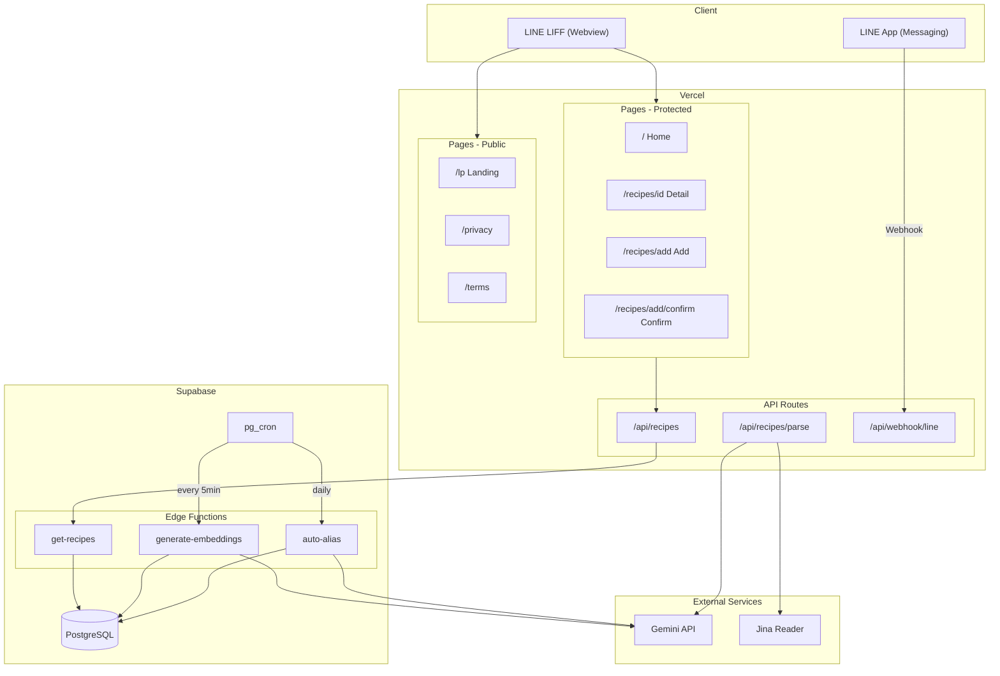
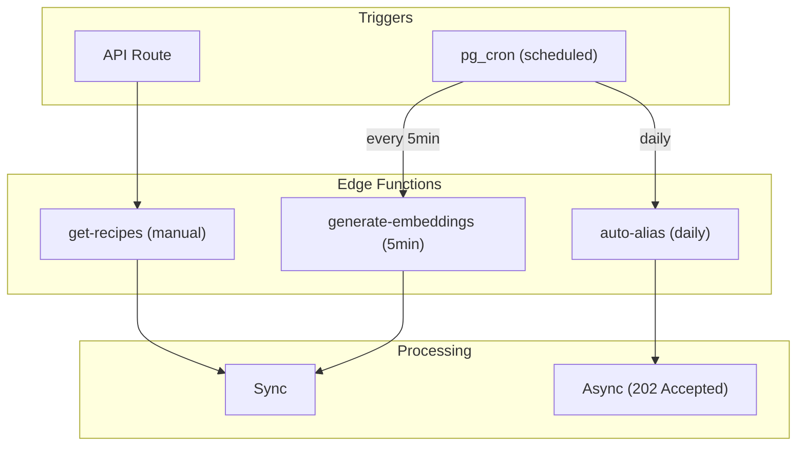
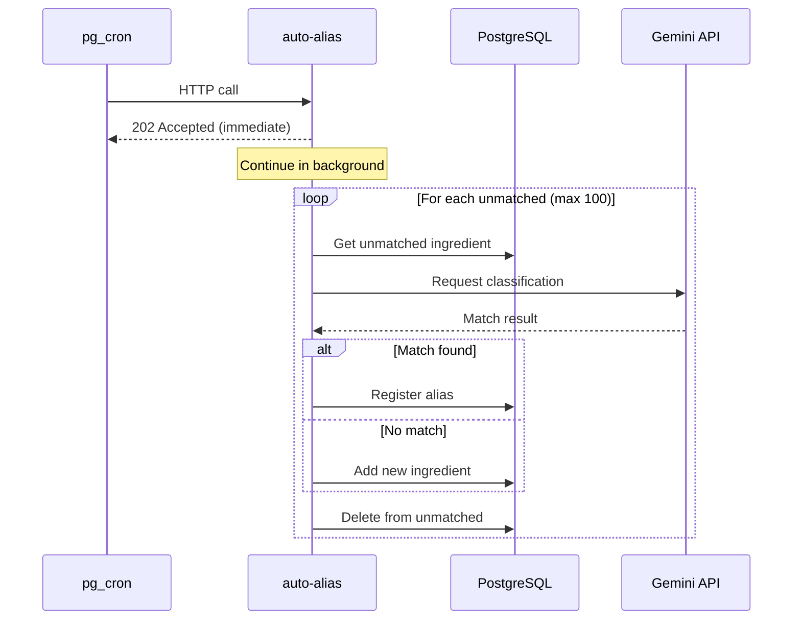
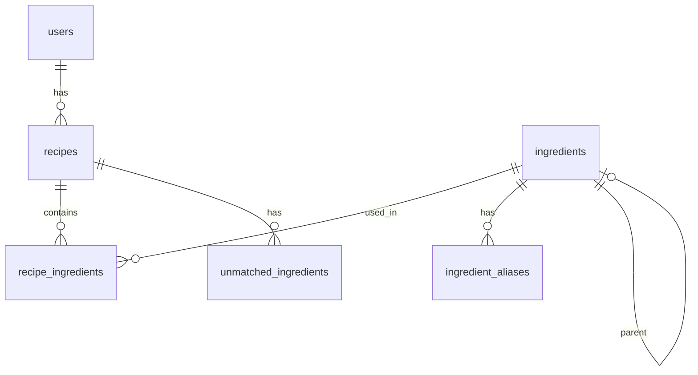
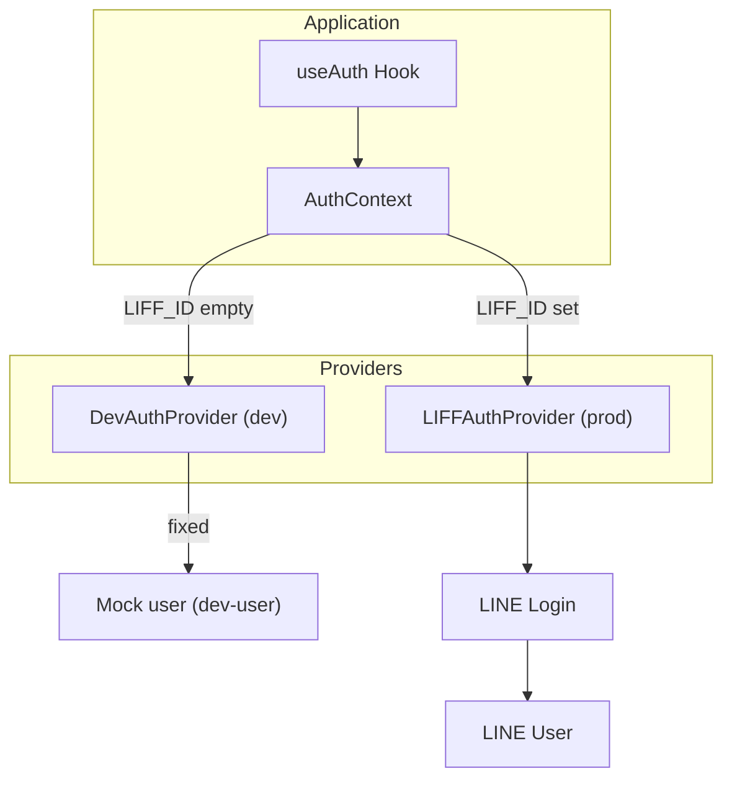
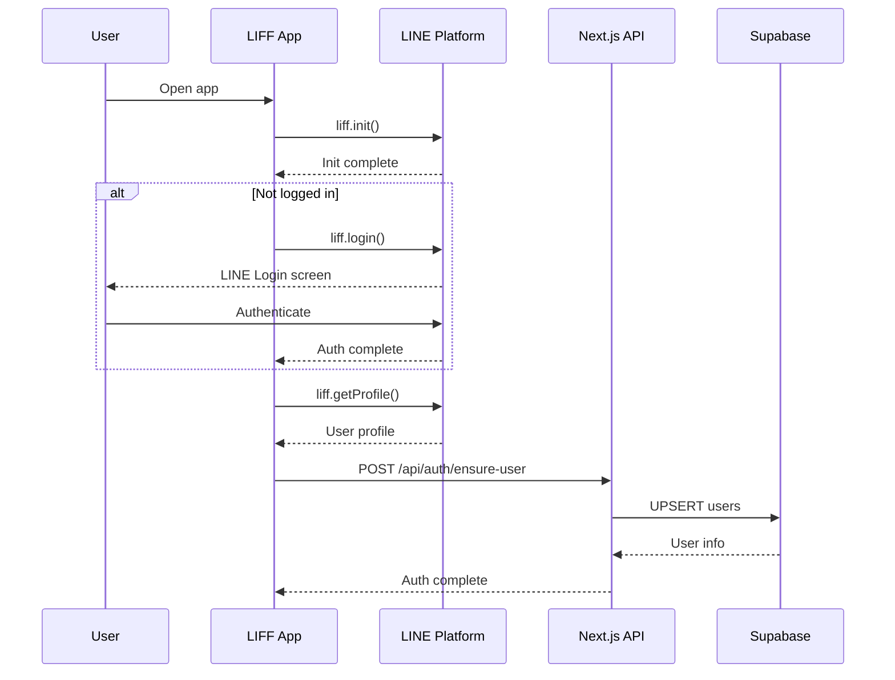
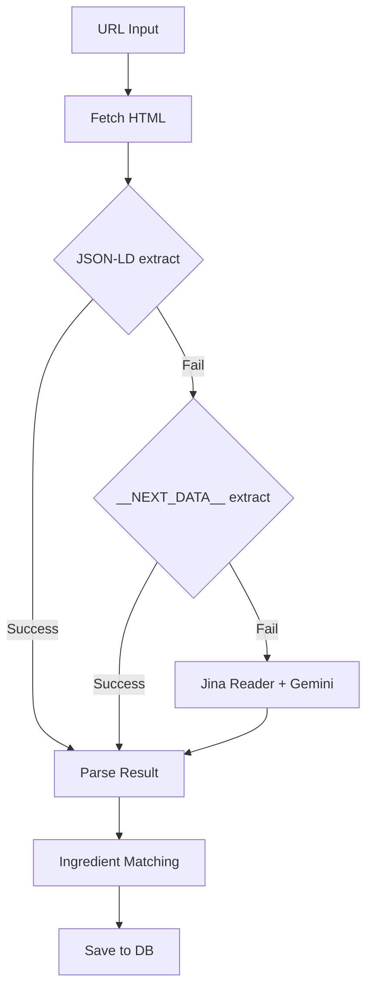
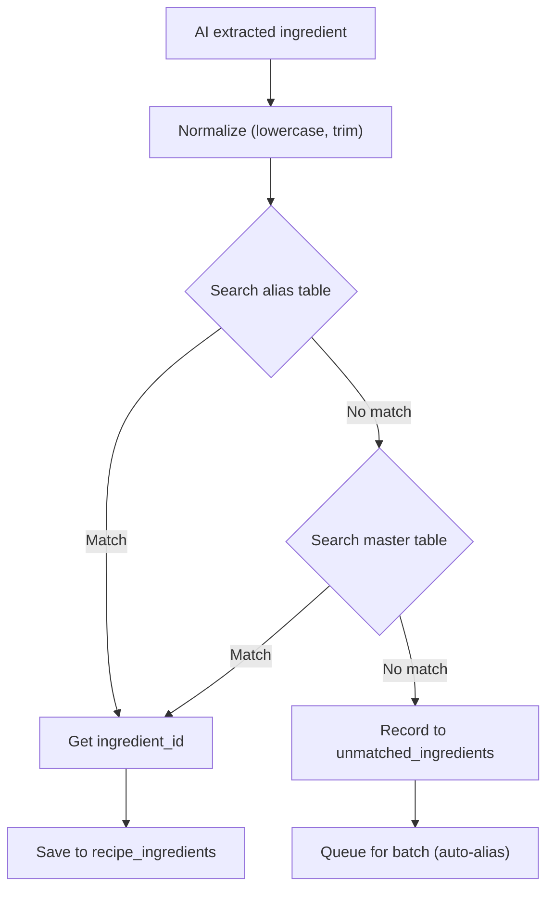
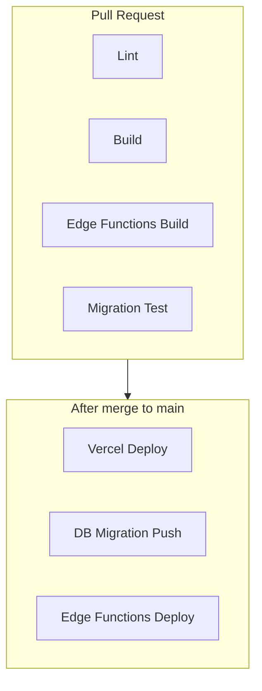

# RecipeHub アーキテクチャドキュメント

## 目次

1. [概要](#概要)
2. [技術スタック](#技術スタック)
3. [ディレクトリ構造](#ディレクトリ構造)
4. [環境構成](#環境構成)
5. [システム構成図](#システム構成図)
6. [ページ構成](#ページ構成)
7. [API構成](#api構成)
8. [Edge Functions](#edge-functions)
9. [データベース設計](#データベース設計)
10. [認証フロー](#認証フロー)
11. [レシピ解析フロー](#レシピ解析フロー)
12. [食材名寄せフロー](#食材名寄せフロー)
13. [CI/CD](#cicd)

> 開発ルール・コマンドは `CLAUDE.md` を参照

---

## 概要

**RecipeHub** は、複数のレシピサイトや SNS からお気に入りレシピを URL で集約し、食材タグで検索できる自分専用のレシピ図鑑アプリ。

**ビジョン:** 「献立の意思決定コストをゼロにする」

**主な機能:**
- URL からレシピ情報を自動抽出（AI解析）
- 食材タグによる絞り込み検索
- セマンティック検索（ベクトル検索）
- LINE Bot 連携

---

## 技術スタック

```
┌─────────────────────────────────────────────────────────────────┐
│                        Frontend                                  │
│  ┌─────────────┐  ┌─────────────┐  ┌─────────────────────────┐  │
│  │   Next.js   │  │    React    │  │  Tailwind CSS           │  │
│  │ (App Router)│  │             │  │  + shadcn/ui (Radix UI) │  │
│  └─────────────┘  └─────────────┘  └─────────────────────────┘  │
└─────────────────────────────────────────────────────────────────┘
                              │
                              ▼
┌─────────────────────────────────────────────────────────────────┐
│                        Backend                                   │
│  ┌─────────────────────┐  ┌─────────────────────────────────┐   │
│  │  Supabase           │  │  Edge Functions (Deno)          │   │
│  │  - PostgreSQL       │  │  - get-recipes                  │   │
│  │  - pgvector         │  │  - generate-embeddings          │   │
│  │  - pg_cron          │  │  - auto-alias                   │   │
│  └─────────────────────┘  └─────────────────────────────────┘   │
└─────────────────────────────────────────────────────────────────┘
                              │
                              ▼
┌─────────────────────────────────────────────────────────────────┐
│                     External Services                            │
│  ┌───────────────┐  ┌───────────────┐  ┌───────────────────┐    │
│  │ Google Gemini │  │  Jina Reader  │  │  LINE Platform    │    │
│  └───────────────┘  └───────────────┘  └───────────────────┘    │
└─────────────────────────────────────────────────────────────────┘
```

### 主要ライブラリ

| カテゴリ | ライブラリ |
|---------|----------|
| Framework | Next.js (App Router) |
| UI | React, Tailwind CSS, shadcn/ui |
| Database | Supabase (PostgreSQL) |
| Data Fetching | SWR |
| AI | Vercel AI SDK + Google Gemini |
| LINE | LIFF SDK, Messaging API SDK |
| Validation | Zod |

---

## ディレクトリ構造

```
recipe-app/
├── src/
│   ├── app/
│   │   ├── (protected)/      # 認証必須ページ（一覧・詳細・登録）
│   │   ├── (public)/         # 認証不要ページ（LP・利用規約等）
│   │   └── api/              # API Routes
│   ├── components/
│   │   ├── ui/               # shadcn/ui コンポーネント
│   │   ├── features/         # 機能別コンポーネント
│   │   └── providers/        # Context プロバイダー
│   ├── hooks/                # カスタム hooks
│   ├── lib/
│   │   ├── auth/             # 認証プロバイダー (LIFF / Dev)
│   │   ├── batch/            # Edge Functions 共有ロジック（Node.js）
│   │   ├── db/               # Supabase クライアント・クエリ
│   │   ├── embedding/        # ベクトル埋め込み
│   │   ├── line/             # LINE Bot・Flex Message
│   │   ├── llm/              # LLM 関連 (レシピ解析)
│   │   ├── recipe/           # レシピ処理ロジック
│   │   └── scraper/          # JSON-LD・Jina スクレイパー
│   └── types/                # 型定義
├── supabase/
│   ├── functions/            # Edge Functions (Deno)
│   └── migrations/           # DB マイグレーション
├── seed/                     # シードデータ
│   └── ingredients.json      # 食材マスター初期データ
├── docs/                     # ドキュメント
│   ├── backlogs/             # エピック別バックログ
│   └── ...
└── scripts/                  # 開発・運用スクリプト
```

---

## 環境構成

### 環境一覧

| コンポーネント | Local | Staging (現在本番) | Production (未作成) |
|--------------|-------|-------------------|-------------------|
| **Next.js** | localhost:3000 | Vercel | Vercel |
| **Supabase DB** | localhost:54322 | Supabase Cloud | Supabase Cloud (東京) |
| **Edge Functions** | supabase functions serve | Supabase Cloud | Supabase Cloud |
| **認証** | DevAuthProvider (モック) | LIFFAuthProvider | LIFFAuthProvider |
| **LINE Bot** | ngrok経由 | 本番Webhook | 本番Webhook |

**ローカル起動:**
```bash
supabase start      # Supabase ローカル起動
npm run dev         # Next.js 開発サーバー
```

> `NEXT_PUBLIC_LIFF_ID` を空にすると DevAuthProvider（モックユーザー）で動作

---

## システム構成図

### 全体アーキテクチャ



---

## ページ構成

| パス | 認証 | 説明 |
|-----|------|------|
| `/` | 必須 | レシピ一覧・食材フィルター・検索 |
| `/recipes/[id]` | 必須 | レシピ詳細・メモ編集・削除 |
| `/recipes/add` | 必須 | レシピURL入力 |
| `/recipes/add/confirm` | 必須 | 解析結果確認・食材選択・保存 |
| `/lp` | 不要 | 機能紹介・CTA |
| `/privacy` | 不要 | プライバシーポリシー |
| `/terms` | 不要 | 利用規約 |

---

## API構成

| エンドポイント | メソッド | 説明 |
|--------------|---------|------|
| `/api/auth/ensure-user` | POST | ユーザー確保（LINE UserID → DB登録） |
| `/api/recipes` | POST | レシピ作成 |
| `/api/recipes/[id]` | GET/PUT/DELETE | レシピ詳細取得・更新・削除 |
| `/api/recipes/list` | POST | 一覧取得（Edge Function経由） |
| `/api/recipes/parse` | POST | URL解析（Jina + Gemini） |
| `/api/webhook/line` | POST | LINE Webhook |

---

## Edge Functions

### 概要

Edge Functions は Supabase 上で動作する Deno ランタイムの関数。
**DB と同一リージョンで実行されるため低レイテンシ**を実現。



### Edge Function 詳細

| 関数 | トリガー | 処理方式 | 説明 |
|------|---------|---------|------|
| `get-recipes` | API Route | 同期 | レシピ一覧取得（複数クエリ） |
| `generate-embeddings` | pg_cron (5分毎) | 同期 | 埋め込みベクトル生成 |
| `auto-alias` | pg_cron (1日1回) | **非同期** | 食材エイリアス自動生成 |

### auto-alias の非同期パターン

pg_cron には **タイムアウト制限**があるため、`auto-alias` は非同期パターンを採用。



### ソースコード管理

Edge Function の共有ロジックは `src/lib/batch/` で管理し、ビルド時に Deno 用に変換。

```
src/lib/batch/     →  npm run functions:build  →  supabase/functions/*/
(Node.js)                                          (Deno)
```

> 詳細は `docs/EDGE_FUNCTIONS.md` を参照

---

## データベース設計

### ER図



### テーブル概要

| テーブル | 説明 |
|---------|------|
| `users` | LINE ユーザー情報 |
| `recipes` | レシピ情報（タイトル、URL、画像、メモ、埋め込みベクトル） |
| `ingredients` | 食材マスター（階層構造対応） |
| `ingredient_aliases` | 表記ゆれ対応（LLM自動生成含む） |
| `recipe_ingredients` | レシピ - 食材の中間テーブル |
| `unmatched_ingredients` | バッチ処理待ちの未マッチ食材 |

> 詳細なスキーマは `supabase/migrations/` を参照

---

## 認証フロー

### 認証プロバイダー抽象化



### LINE LIFF 認証フロー



---

## レシピ解析フロー

### 解析戦略（フォールバック）



---

## 食材名寄せフロー

### 登録時のマッチング



> バッチ処理の詳細は [Edge Functions](#edge-functions) セクションを参照

---

## CI/CD

### ワークフロー概要



### GitHub Actions ワークフロー

| ワークフロー | トリガー | 処理内容 |
|------------|---------|---------|
| `ci.yml` | PR → main | Lint + Build + Functions Build |
| `test-migrations.yml` | PR (migrations変更時) | マイグレーションテスト |
| `supabase-migrate.yml` | Push → main (migrations変更時) | 本番DBマイグレーション |
| `supabase-functions.yml` | Push → main (functions変更時) | Edge Functionsデプロイ |

### デプロイ先

| コンポーネント | デプロイ先 | 方法 |
|--------------|----------|------|
| Next.js App | Vercel | Git 連携 (自動) |
| DB Migrations | Supabase | GitHub Actions |
| Edge Functions | Supabase | GitHub Actions |

> ディレクトリ構造の詳細は `CLAUDE.md` を参照
