# RecipeHub アーキテクチャドキュメント

## 目次

1. [概要](#概要)
2. [技術スタック](#技術スタック)
3. [ディレクトリ構造](#ディレクトリ構造)
4. [環境構成](#環境構成)
5. [システム構成図](#システム構成図)
6. [ページ構成](#ページ構成)
7. [API構成](#api構成)
8. [Edge Functions](#edge-functions)
9. [データベース設計](#データベース設計)
10. [認証フロー](#認証フロー)
11. [レシピ解析フロー](#レシピ解析フロー)
12. [食材名寄せフロー](#食材名寄せフロー)
13. [CI/CD](#cicd)

> 開発ルール・コマンドは `CLAUDE.md` を参照

---

## 概要

**RecipeHub** は、複数のレシピサイトや SNS からお気に入りレシピを URL で集約し、食材タグで検索できる自分専用のレシピ図鑑アプリ。

**ビジョン:** 「献立選びをもっとラクに」

**主な機能:**
- URL からレシピ情報を自動抽出（AI解析）
- 食材タグによる絞り込み検索
- セマンティック検索（ベクトル検索）
- LINE Bot 連携

---

## 技術スタック

```
┌─────────────────────────────────────────────────────────────────┐
│                        Frontend                                  │
│  ┌─────────────┐  ┌─────────────┐  ┌─────────────────────────┐  │
│  │   Next.js   │  │    React    │  │  Tailwind CSS           │  │
│  │ (App Router)│  │             │  │  + shadcn/ui (Radix UI) │  │
│  └─────────────┘  └─────────────┘  └─────────────────────────┘  │
└─────────────────────────────────────────────────────────────────┘
                              │
                              ▼
┌─────────────────────────────────────────────────────────────────┐
│                        Backend                                   │
│  ┌─────────────────────┐  ┌─────────────────────────────────┐   │
│  │  Supabase           │  │  Edge Functions (Deno)          │   │
│  │  - PostgreSQL       │  │  - get-recipes                  │   │
│  │  - pgvector         │  │  - generate-embeddings          │   │
│  │  - pg_cron          │  │  - auto-alias                   │   │
│  │                     │  │  - audit-auto-generated         │   │
│  └─────────────────────┘  └─────────────────────────────────┘   │
└─────────────────────────────────────────────────────────────────┘
                              │
                              ▼
┌─────────────────────────────────────────────────────────────────┐
│                     External Services                            │
│  ┌───────────────┐  ┌───────────────────┐                       │
│  │ Google Gemini │  │  LINE Platform    │                       │
│  └───────────────┘  └───────────────────┘                       │
└─────────────────────────────────────────────────────────────────┘
```

### 主要ライブラリ

| カテゴリ | ライブラリ |
|---------|----------|
| Framework | Next.js (App Router) |
| UI | React, Tailwind CSS, shadcn/ui |
| Database | Supabase (PostgreSQL) |
| Data Fetching | SWR |
| AI | Vercel AI SDK + Google Gemini (Embedding) |
| LINE | LIFF SDK, Messaging API SDK |
| Validation | Zod |

---

## ディレクトリ構造

```
recipe-app/
├── src/
│   ├── app/
│   │   ├── (protected)/      # 認証必須ページ（一覧・詳細・登録）
│   │   ├── (public)/         # 認証不要ページ（LP・利用規約等）
│   │   └── api/              # API Routes
│   ├── components/
│   │   ├── ui/               # shadcn/ui コンポーネント
│   │   ├── features/         # 機能別コンポーネント
│   │   └── providers/        # Context プロバイダー
│   ├── hooks/                # カスタム hooks
│   ├── lib/
│   │   ├── api/              # API エラーレスポンスユーティリティ
│   │   ├── async/            # レスポンス後バックグラウンド処理ユーティリティ
│   │   ├── auth/             # 認証プロバイダー (LIFF / Dev)
│   │   ├── batch/            # Edge Functions 共有ロジック（Node.js）
│   │   ├── db/               # Supabase クライアント・クエリ
│   │   ├── embedding/        # ベクトル埋め込み
│   │   ├── line/             # LINE Bot・Flex Message
│   │   ├── recipe/           # レシピ処理ロジック
│   │   └── scraper/          # JSON-LD・__NEXT_DATA__・OGP スクレイパー
│   └── types/                # 型定義
├── supabase/
│   ├── functions/            # Edge Functions (Deno)
│   └── migrations/           # DB マイグレーション
├── seed/                     # シードデータ
│   └── ingredients.json      # 食材マスター初期データ
├── docs/                     # ドキュメント
└── scripts/                  # 開発・運用スクリプト
```

---

## 環境構成

### 環境一覧

| コンポーネント | Local | Staging | Production |
|--------------|-------|---------|-----------|
| **Next.js** | localhost:3000 | Vercel (develop ブランチ) | Vercel (main ブランチ) |
| **Supabase DB** | localhost:54322 | Supabase Cloud (staging) | Supabase Cloud (東京・本番) |
| **Edge Functions** | supabase functions serve | Supabase Cloud (staging) | Supabase Cloud (本番) |
| **認証** | DevAuthProvider (モック) | LIFFAuthProvider | LIFFAuthProvider |
| **LINE Bot** | ngrok経由 | 開発用チャネル | 本番チャネル |

**ローカル起動:**
```bash
supabase start      # Supabase ローカル起動
npm run dev         # Next.js 開発サーバー
```

> `NEXT_PUBLIC_LIFF_ID` を空にすると DevAuthProvider（モックユーザー）で動作

---

## システム構成図

### 全体アーキテクチャ

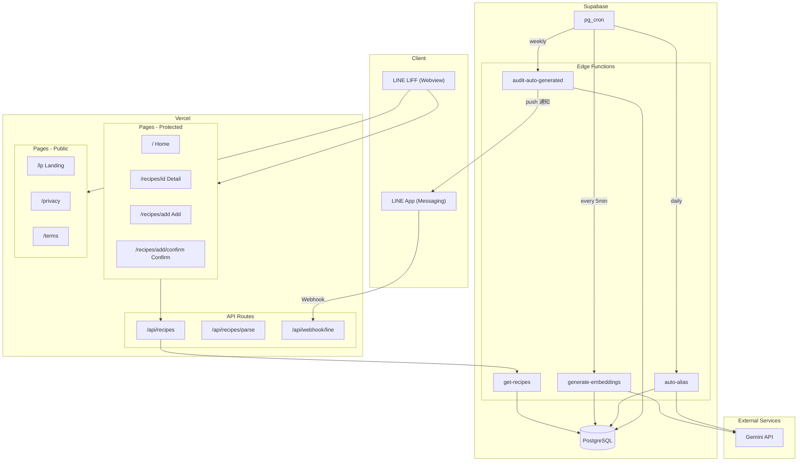
```mermaid
graph TB
    subgraph Client["Client"]
        LIFF["LINE LIFF (Webview)"]
        LINEApp["LINE App (Messaging)"]
    end

    subgraph Vercel["Vercel"]
        subgraph Pages["Pages - Protected"]
            Home["/ Home"]
            Detail["/recipes/id Detail"]
            Add["/recipes/add Add"]
            Confirm["/recipes/add/confirm Confirm"]
        end

        subgraph Public["Pages - Public"]
            LP["/lp Landing"]
            Privacy["/privacy"]
            Terms["/terms"]
        end

        subgraph APIRoutes["API Routes"]
            RecipeAPI["/api/recipes"]
            ParseAPI["/api/recipes/parse"]
            WebhookAPI["/api/webhook/line"]
        end
    end

    subgraph Supabase["Supabase"]
        DB[("PostgreSQL")]

        subgraph EdgeFunctions["Edge Functions"]
            GetRecipes["get-recipes"]
            GenEmbed["generate-embeddings"]
            AutoAlias["auto-alias"]
            Audit["audit-auto-generated"]
        end

        Cron["pg_cron"]
    end

    subgraph External["External Services"]
        Gemini["Gemini API"]
    end

    LIFF --> Pages
    LIFF --> Public
    LINEApp -->|Webhook| WebhookAPI

    Pages --> RecipeAPI
    RecipeAPI --> GetRecipes

    GetRecipes --> DB
    GenEmbed --> DB
    GenEmbed --> Gemini
    AutoAlias --> DB
    AutoAlias --> Gemini
    Audit --> DB
    Audit -->|push 通知| LINEApp

    Cron -->|every 5min| GenEmbed
    Cron -->|daily| AutoAlias
    Cron -->|weekly| Audit
```

---

## ページ構成

| パス | 認証 | 説明 |
|-----|------|------|
| `/` | 必須 | レシピ一覧・食材フィルター・検索 |
| `/recipes/[id]` | 必須 | レシピ詳細・メモ編集・削除 |
| `/recipes/add` | 必須 | レシピURL入力 |
| `/recipes/add/confirm` | 必須 | 解析結果確認・食材選択・保存 |
| `/lp` | 不要 | 機能紹介・CTA |
| `/privacy` | 不要 | プライバシーポリシー |
| `/terms` | 不要 | 利用規約 |

---

## API構成

クライアント（LIFF）から呼ぶ API は **LINE ID トークン検証**で保護する。クライアントは `Authorization: Bearer <idToken>` を付与し（`useAuthedFetch`）、サーバーは `requireLineUser()`（`src/lib/api/auth-guard.ts`）で検証して **検証済み userId のみ**を使用する。body / ヘッダの自己申告 `lineUserId` は信用しない。詳細は [認証フロー](#認証フロー) を参照。

| エンドポイント | メソッド | 認証 | 説明 |
|--------------|---------|------|------|
| `/api/auth/delete-user` | DELETE | IDトークン | アカウント削除（LINE deauthorize + DB削除） |
| `/api/recipes` | POST | IDトークン | レシピ作成 |
| `/api/recipes/[id]` | GET/PATCH/DELETE | IDトークン | レシピ詳細取得・更新（メモ）・削除 |
| `/api/recipes/list` | POST | IDトークン | 一覧取得（Edge Function経由） |
| `/api/recipes/parse` | POST | IDトークン | URL解析（JSON-LD / __NEXT_DATA__ / OGP） |
| `/api/track/recipe/[id]` | GET/POST | POSTのみIDトークン | 閲覧記録（GET: LINE用リダイレクト・認証不要、POST: LIFF用） |
| `/api/webhook/line` | POST | LINE署名検証 | LINE Webhook（`validateSignature`） |

> dev モード（`NEXT_PUBLIC_LIFF_ID` 空）では ID トークン検証をバイパスし `dev-user-001` として扱う（`src/lib/auth/verify-line-token.ts`）。

---

## Edge Functions

### 概要

Edge Functions は Supabase 上で動作する Deno ランタイムの関数。
**DB と同一リージョンで実行されるため低レイテンシ**を実現。

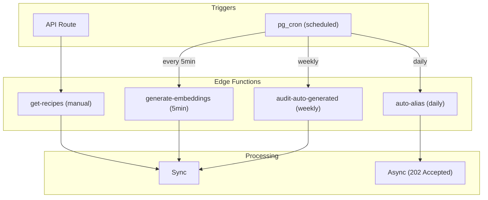
```mermaid
graph TB
    subgraph Triggers["Triggers"]
        API["API Route"]
        Cron["pg_cron (scheduled)"]
    end

    subgraph Functions["Edge Functions"]
        GetRecipes["get-recipes (manual)"]
        GenEmbed["generate-embeddings (5min)"]
        AutoAlias["auto-alias (daily)"]
        Audit["audit-auto-generated (weekly)"]
    end

    subgraph Processing["Processing"]
        Sync["Sync"]
        Async["Async (202 Accepted)"]
    end

    API --> GetRecipes
    Cron -->|every 5min| GenEmbed
    Cron -->|daily| AutoAlias
    Cron -->|weekly| Audit

    GetRecipes --> Sync
    GenEmbed --> Sync
    AutoAlias --> Async
    Audit --> Sync
```

### Edge Function 詳細

| 関数 | トリガー | 処理方式 | 説明 |
|------|---------|---------|------|
| `get-recipes` | API Route | 同期 | レシピ一覧取得・検索（複数クエリ） |
| `generate-embeddings` | pg_cron (5分毎) | 同期 | 埋め込みベクトル生成 |
| `auto-alias` | pg_cron (1日1回) | **非同期** | 食材エイリアス自動生成 |
| `audit-auto-generated` | pg_cron (毎週月曜) | 同期 | 自動追加食材を管理者へ LINE 通知（事後監査） |

> cron ジョブ定義の正本は `scripts/setup-cron.ts`（出力 SQL を SQL Editor で実行する運用）。

### auto-alias の非同期パターン

pg_cron には **タイムアウト制限**があるため、`auto-alias` は非同期パターンを採用。

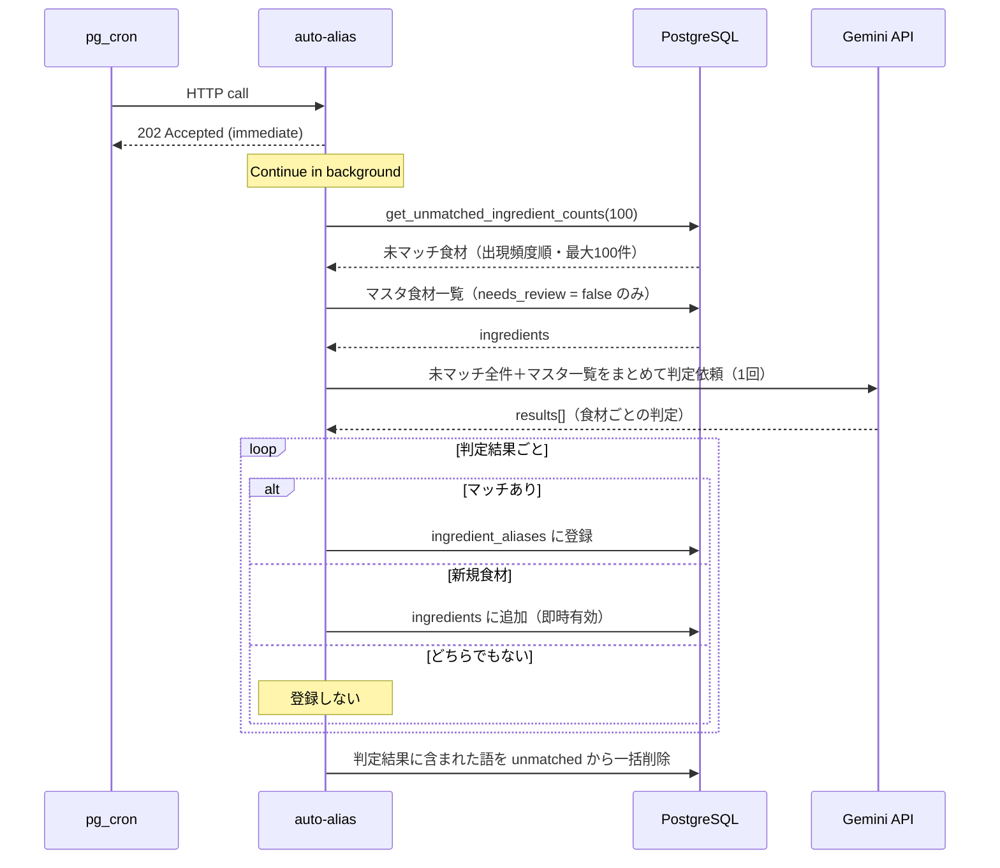
```mermaid
sequenceDiagram
    participant Cron as pg_cron
    participant Func as auto-alias
    participant DB as PostgreSQL
    participant LLM as Gemini API

    Cron->>Func: HTTP call
    Func-->>Cron: 202 Accepted (immediate)

    Note over Func: Continue in background

    Func->>DB: get_unmatched_ingredient_counts(100)
    DB-->>Func: 未マッチ食材（出現頻度順・最大100件）
    Func->>DB: マスタ食材一覧（needs_review = false のみ）
    DB-->>Func: ingredients

    Func->>LLM: 未マッチ全件＋マスタ一覧をまとめて判定依頼（1回）
    LLM-->>Func: results[]（食材ごとの判定）

    loop 判定結果ごと
        alt マッチあり
            Func->>DB: ingredient_aliases に登録
        else 新規食材
            Func->>DB: ingredients に追加（即時有効）
        else どちらでもない
            Note over Func: 登録しない
        end
    end

    Func->>DB: 判定結果に含まれた語を unmatched から一括削除
```

> **Gemini 呼び出しは1実行あたり1回**。未マッチ食材は全件まとめて1つのプロンプトに載せ、
> ループしているのは返ってきた判定結果を DB に反映する部分だけ
> （`src/lib/batch/alias-generator.ts`）。処理上限 100 件はプロンプトに載せる語数の上限であり、
> API 呼び出し回数ではない。

> 判定ルールと結果の扱い（新規食材の即時有効・未マッチの削除条件）は
> [食材名寄せフロー](#食材名寄せフロー) の「バッチでの名寄せ」を参照。

### ソースコード管理

Edge Function の共有ロジックは `src/lib/` 配下で管理し、ビルド時に Deno 用に変換。

```
src/lib/batch/     →  npm run functions:build  →  supabase/functions/auto-alias/
                                                  supabase/functions/audit-auto-generated/
src/lib/search/                                   supabase/functions/get-recipes/search/
(Node.js)                                         (Deno)
```

| 共有元 | 利用する Edge Function | 内容 |
|--------|------------------------|------|
| `src/lib/batch/` | `auto-alias` | エイリアス自動生成（ローカルスクリプトと共有） |
| `src/lib/batch/` | `audit-auto-generated` | 自動追加食材の監査レポート組み立て（ローカルスクリプトと共有） |
| `src/lib/search/` | `get-recipes` | 検索クエリの解決・絞り込み（LINE Bot と共有） |

> 共有元を追加したら `.github/workflows/supabase-functions.yml` の `paths` にも追加すること。
> 生成物は gitignore 対象のため、追加しないとソース変更時にデプロイが走らない。

> 詳細は `docs/EDGE_FUNCTIONS.md` を参照

---

## データベース設計

### ER図

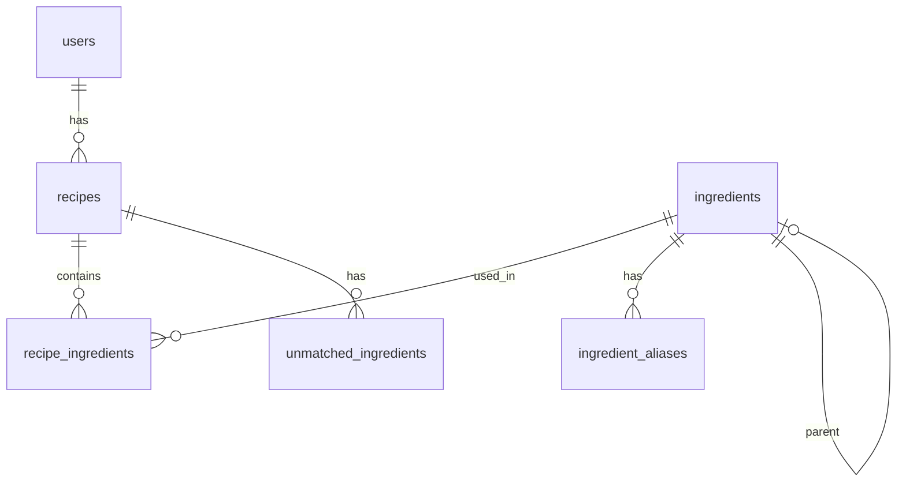
```mermaid
erDiagram
    users ||--o{ recipes : "has"
    recipes ||--o{ recipe_ingredients : "contains"
    ingredients ||--o{ recipe_ingredients : "used_in"
    ingredients ||--o{ ingredient_aliases : "has"
    ingredients ||--o| ingredients : "parent"
    recipes ||--o{ unmatched_ingredients : "has"

    users
    recipes
    ingredients
    ingredient_aliases
    recipe_ingredients
    unmatched_ingredients
```

### テーブル概要

| テーブル | 説明 |
|---------|------|
| `users` | LINE ユーザー情報 |
| `recipes` | レシピ情報（タイトル、URL、画像、メモ、埋め込みベクトル） |
| `ingredients` | 食材マスター（階層構造対応） |
| `ingredient_aliases` | 表記ゆれ対応（LLM自動生成含む） |
| `recipe_ingredients` | レシピ - 食材の中間テーブル |
| `unmatched_ingredients` | バッチ処理待ちの未マッチ食材 |

> 詳細なスキーマは `supabase/migrations/` を参照

---

## 認証フロー

### 認証プロバイダー抽象化

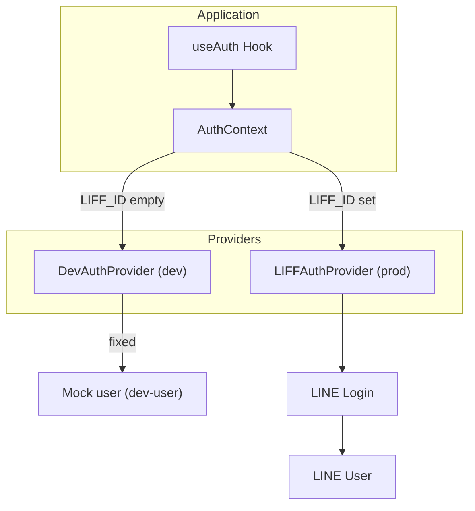
```mermaid
graph TB
    subgraph App["Application"]
        useAuth["useAuth Hook"]
        Context["AuthContext"]
    end

    subgraph Providers["Providers"]
        Dev["DevAuthProvider (dev)"]
        LIFF["LIFFAuthProvider (prod)"]
    end

    useAuth --> Context
    Context -->|LIFF_ID empty| Dev
    Context -->|LIFF_ID set| LIFF

    Dev -->|fixed| MockUser["Mock user (dev-user)"]
    LIFF --> LINELogin["LINE Login"]
    LINELogin --> LINEUser["LINE User"]
```

### ユーザー登録フロー

ユーザーは **LINE Bot を友達追加したタイミング**で登録される（下図）。加えて、Webhook 側の `ensureUser()` は **URL 送信時・検索メッセージ受信時**にも呼ばれるため、友達追加イベントを取りこぼした場合でも初回操作時に遅延登録される（`src/app/api/webhook/line/route.ts`、`src/lib/line/url-handler.ts`、`src/lib/line/search-handler.ts`）。

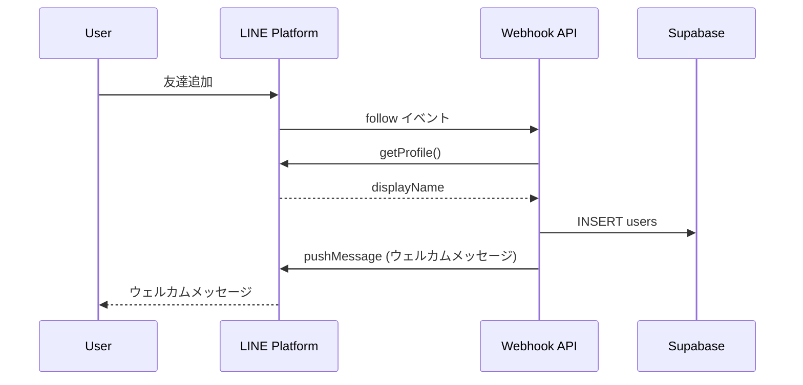
```mermaid
sequenceDiagram
    participant User as User
    participant LINE as LINE Platform
    participant Webhook as Webhook API
    participant DB as Supabase

    User->>LINE: 友達追加
    LINE->>Webhook: follow イベント
    Webhook->>LINE: getProfile()
    LINE-->>Webhook: displayName
    Webhook->>DB: INSERT users
    Webhook->>LINE: pushMessage (ウェルカムメッセージ)
    LINE-->>User: ウェルカムメッセージ
```

> follow イベント以外（URL 送信・検索）での登録は `ensureUser()` による冪等な確保処理（存在すれば何もしない）。ウェルカムメッセージは follow イベント時のみ送信される。

### LINE LIFF 認証フロー

LIFF アクセス時はユーザー登録は行わず、LINE SDK から profile を取得してメモリ上で保持する。

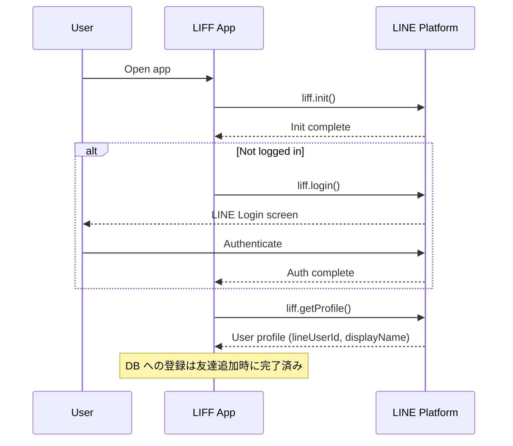
```mermaid
sequenceDiagram
    participant User as User
    participant LIFF as LIFF App
    participant LINE as LINE Platform

    User->>LIFF: Open app
    LIFF->>LINE: liff.init()
    LINE-->>LIFF: Init complete

    alt Not logged in
        LIFF->>LINE: liff.login()
        LINE-->>User: LINE Login screen
        User->>LINE: Authenticate
        LINE-->>LIFF: Auth complete
    end

    LIFF->>LINE: liff.getProfile()
    LINE-->>LIFF: User profile (lineUserId, displayName)
    Note over LIFF: DB への登録は友達追加時に完了済み
```

### API 認証（ID トークン検証）

LIFF クライアントから API を呼ぶ際は、`liff.getIDToken()` の ID トークンを `Authorization: Bearer` ヘッダで送信し、サーバー側で検証する。これにより、自己申告の `lineUserId` を信用せず、なりすまし（IDOR）を防ぐ。

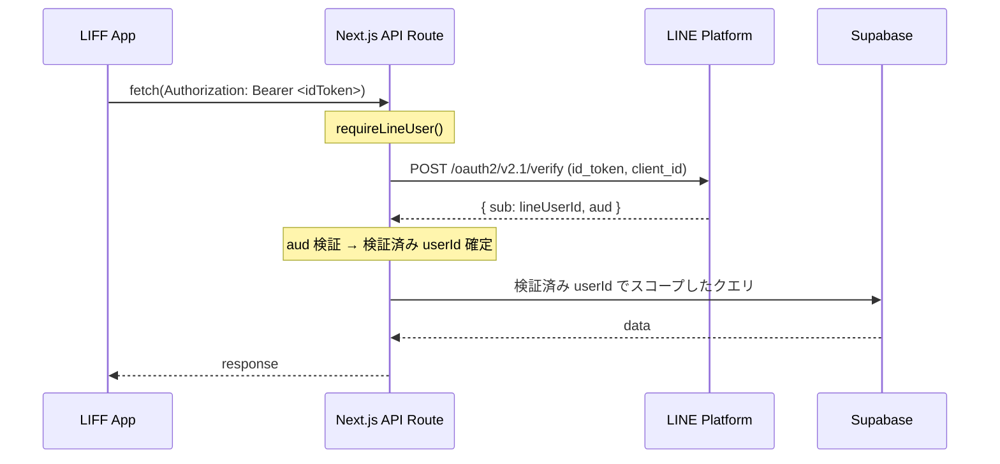
```mermaid
sequenceDiagram
    participant LIFF as LIFF App
    participant API as Next.js API Route
    participant LINE as LINE Platform
    participant DB as Supabase

    LIFF->>API: fetch(Authorization: Bearer <idToken>)
    Note over API: requireLineUser()
    API->>LINE: POST /oauth2/v2.1/verify (id_token, client_id)
    LINE-->>API: { sub: lineUserId, aud }
    Note over API: aud 検証 → 検証済み userId 確定
    API->>DB: 検証済み userId でスコープしたクエリ
    DB-->>API: data
    API-->>LIFF: response
```

> サーバーは Service Role キーで接続し RLS をバイパスするため、アクセス制御はこの API 層のトークン検証＋userId スコープが担う。RLS は多層防御（defense-in-depth）のバックストップとして機能する：ユーザーデータテーブル（`users`/`recipes`/`recipe_ingredients`）は service_role 以外（ブラウザに露出する publishable/anon キー）からのアクセスを拒否し、公開マスター（`ingredients`/`ingredient_aliases`）のみ anon 参照を許可する。本アプリは LINE 認証で Supabase Auth ユーザーを持たないため `auth.uid()` ベースのポリシーは使わず、ロール（service_role）ベースのポリシーで表現する（Issue #110、`supabase/migrations/20260702000000_clarify_rls_policies.sql`）。

---

## レシピ解析フロー

### 解析戦略

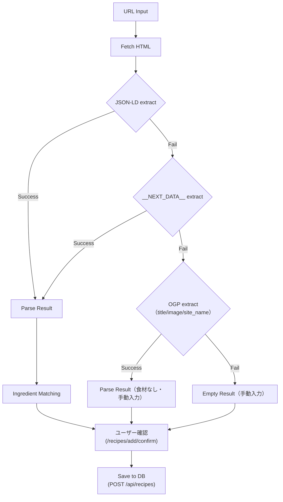
```mermaid
graph TB
    Start["URL Input"] --> Fetch["Fetch HTML"]

    Fetch --> Strategy1{"JSON-LD extract"}
    Strategy1 -->|Success| Result["Parse Result"]
    Strategy1 -->|Fail| Strategy2{"__NEXT_DATA__ extract"}

    Strategy2 -->|Success| Result
    Strategy2 -->|Fail| Strategy3{"OGP extract（title/image/site_name）"}

    Strategy3 -->|Success| OgpResult["Parse Result（食材なし・手動入力）"]
    Strategy3 -->|Fail| Empty["Empty Result（手動入力）"]

    Result --> Match["Ingredient Matching"]
    OgpResult --> Confirm
    Empty --> Confirm
    Match --> Confirm["ユーザー確認\n(/recipes/add/confirm)"]
    Confirm --> Save["Save to DB\n(POST /api/recipes)"]
```

> 取得対象・アクセス様態・robots.txt / 対象サイト利用規約に対する方針は `docs/SCRAPING_POLICY.md` を参照。

---

## 食材名寄せフロー

### 登録時のマッチング

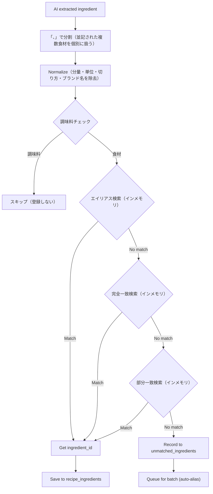
```mermaid
graph TB
    Input["AI extracted ingredient"] --> Split["「、」で分割（並記された複数食材を個別に扱う）"]
    Split --> Normalize["Normalize（分量・単位・切り方・ブランド名を除去）"]
    Normalize --> SeasoningCheck{"調味料チェック"}

    SeasoningCheck -->|調味料| Skip["スキップ（登録しない）"]
    SeasoningCheck -->|食材| AliasCheck{"エイリアス検索（インメモリ）"}

    AliasCheck -->|Match| Found["Get ingredient_id"]
    AliasCheck -->|No match| ExactCheck{"完全一致検索（インメモリ）"}

    ExactCheck -->|Match| Found
    ExactCheck -->|No match| PartialCheck{"部分一致検索（インメモリ）"}

    PartialCheck -->|Match| Found
    PartialCheck -->|No match| Unmatched["Record to unmatched_ingredients"]

    Found --> Save["Save to recipe_ingredients"]
    Unmatched --> BatchQueue["Queue for batch (auto-alias)"]
```

> 部分一致が走査するのはマスタ食材名だけで、エイリアスは完全一致でしか使われない。
> そのため `ねぎ → 長ねぎ` のようにエイリアスにしか存在しない語は部分一致の材料にならず、
> `青ねぎ` ⊃ `ねぎ` の関係を使えないまま未マッチとして記録される（検索時の部分一致も同じ制約）。

### バッチでの名寄せ（auto-alias の判定）

未マッチとして溜まった食材は、1日1回の `auto-alias` バッチが LLM（Gemini）で
「既存食材の表記揺れ」か「新規食材」かを判定する。
実行の入れ物（非同期パターン・呼び出し回数）は [Edge Functions](#edge-functions) を参照。

#### 判定ルール

`src/lib/batch/alias-llm.ts` の `buildPrompt` が LLM に渡すルール。

| # | ルール | 例 |
|---|--------|-----|
| 1 | 表記揺れ（カタカナ/ひらがな・漢字の違い）は同一食材として扱う | 「長ネギ」→「ねぎ」 |
| 2 | 調理形態の違いは同一食材として扱う | 「豚バラ薄切り肉」→「豚バラ肉」 |
| 3 | ただし食材の種類が異なる場合は区別する | 「豚バラ肉」と「豚こま肉」は別物 |
| 4 | マスターに該当する食材がない場合は新規食材と判定 | 「ヤングコーン」→ 新規追加 |
| 5 | 調味料や一般的でない食材は追加しない | `matchedId: null` かつ `isNewIngredient: false` |

ルール2の「調理形態」は、正規化（`normalizeIngredientName`）で落としきれなかった分の
受け皿でもある。正規化側で除去する切り方の一覧は `src/lib/recipe/normalize-ingredient.ts`
（`CUTTING_STYLES`）を参照。

#### 判定結果の反映

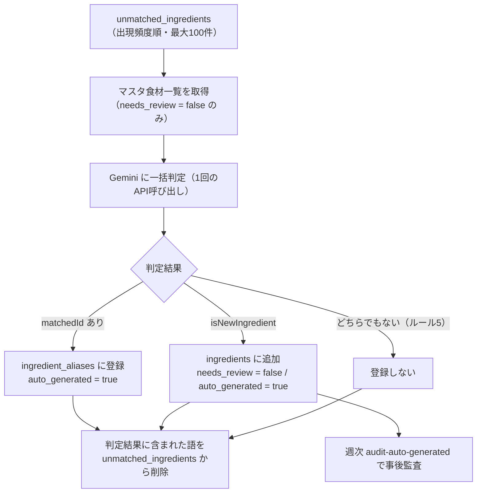
```mermaid
graph TB
    Unmatched["unmatched_ingredients<br/>（出現頻度順・最大100件）"] --> Master["マスタ食材一覧を取得<br/>（needs_review = false のみ）"]
    Master --> LLM["Gemini に一括判定（1回のAPI呼び出し）"]

    LLM --> Judge{"判定結果"}
    Judge -->|matchedId あり| Alias["ingredient_aliases に登録<br/>auto_generated = true"]
    Judge -->|isNewIngredient| New["ingredients に追加<br/>needs_review = false / auto_generated = true"]
    Judge -->|"どちらでもない（ルール5）"| Skip["登録しない"]

    Alias --> Delete["判定結果に含まれた語を<br/>unmatched_ingredients から削除"]
    New --> Delete
    Skip --> Delete

    New --> Audit["週次 audit-auto-generated で事後監査"]
```

#### 押さえておくべき挙動

| 挙動 | 詳細 |
|------|------|
| 新規食材は即時有効 | `needs_review = false` で追加され、そのまま検索・マッチングに乗る。妥当性は週次の `audit-auto-generated` 通知で事後確認する（カテゴリ誤りは `UPDATE`、ゴミ食材は `needs_review = true` で退避）。`needs_review = true` で作ると読み取り側4箇所すべてから外れて行き止まりになる（#148） |
| unmatched の削除は判定結果に依存しない | エイリアス登録・新規追加・ルール5の「登録しない」のいずれでも削除される。同じ食材が再び未マッチで積まれない限り再判定されない |
| LLM が返さなかった語は残る | 削除対象は LLM の `results` に含まれた語だけなので、応答から漏れた語は次回の実行に持ち越される |
| LLM に見えるマスタは `needs_review = false` のみ | レビュー中の食材は候補に出ないため同名を「新規食材」と判定してしまう。これが #148 の重複ループの原因 |
| 新規追加の UNIQUE 違反（23505）はエラー計上 | `ingredients.name` の重複は「登録時のマッチャーが既存食材を取りこぼした」合図なので、握りつぶさずバッチ結果の `errors` に積む |
| `ingredient_aliases.auto_generated` は書くだけ | 読み出し箇所はまだない（監査バッチが見ているのは `ingredients.auto_generated`） |
| エイリアス名は正規化後の文字列 | `unmatched_ingredients.normalized_name` をそのままエイリアス名／新規食材名に使うため、正規化を強化すると古いエイリアスは引かれなくなる |

> 設計判断の経緯は `docs/ADR-001-ingredient-matching.md` を参照。

### 検索時の解決

検索ロジックは `src/lib/search/` が正本で、LINE Bot と Web（`get-recipes` Edge Function）の
両方が同じモジュールを使う。Edge Function 側は `npm run functions:build` でコピーされる。

入力は空白区切りで分割し、語ごとに食材条件かテキスト条件かを判定する。

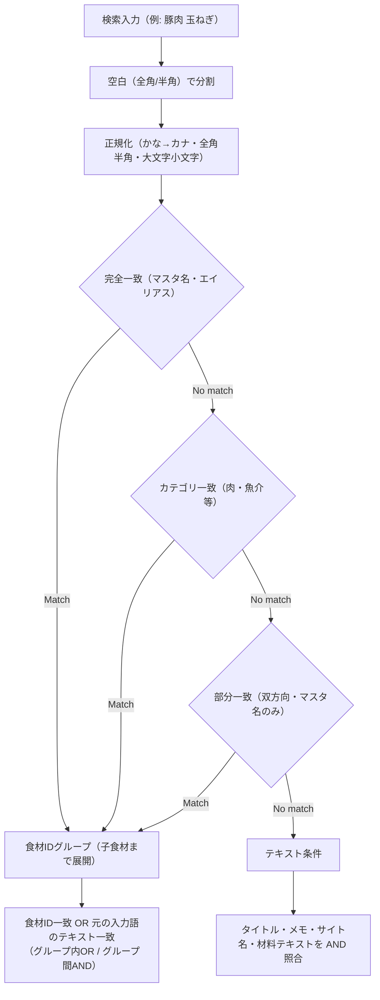
```mermaid
graph TB
    Input["検索入力（例: 豚肉 玉ねぎ）"] --> Split["空白（全角/半角）で分割"]
    Split --> Normalize["正規化（かな→カナ・全角半角・大文字小文字）"]

    Normalize --> ExactCheck{"完全一致（マスタ名・エイリアス）"}
    ExactCheck -->|Match| Group["食材IDグループ（子食材まで展開）"]
    ExactCheck -->|No match| CategoryCheck{"カテゴリ一致（肉・魚介 等）"}

    CategoryCheck -->|Match| Group
    CategoryCheck -->|No match| PartialCheck{"部分一致（双方向・マスタ名のみ）"}

    PartialCheck -->|Match| Group
    PartialCheck -->|No match| Text["テキスト条件"]

    Group --> Filter["食材ID一致 OR 元の入力語のテキスト一致<br/>（グループ内OR / グループ間AND）"]
    Text --> TextFilter["タイトル・メモ・サイト名・材料テキストを AND 照合"]
```

| 特性 | 挙動 |
|------|------|
| 複数キーワード | 語間は AND（「豚肉 玉ねぎ」＝両方を含むレシピ） |
| 候補が複数の語 | 絞り込まず OR（「肉」→ 肉カテゴリ全件、「豚」→ 豚肉系すべて） |
| 親食材 | 子食材まで展開（「豚肉」→ 豚バラ肉・豚こま切れ肉 等） |
| 解決済みの語 | 食材ID一致に加えて元の入力語でもテキスト照合する（「トマト」→ 食材紐付けが無くてもタイトルが「トマトパスタ」ならヒット） |
| カテゴリ語 | テキスト照合には回さない（「肉」で「肉なし〇〇」を拾わないため） |
| 未解決語 | テキスト照合に回る（マスタにない食材も材料テキストで拾える） |
| フィルターバー選択 | 明示選択された食材IDは ID 一致のみ（テキスト照合しない） |
| Bot のみ | テキスト条件を含むクエリで絞り込み結果が 3 件未満なら、ベクトル検索で補完（全語が食材に解決したクエリでは発動しない → #163） |

> 絞り込みは DB クエリではなくユーザーのレシピを取得した上での JS フィルタで行う
> （Bot / Web で同一の照合結果にするため）。レシピ件数が大きく増えた場合は RPC 化を検討する。

---

## CI/CD

### ブランチ戦略

```
feature/* ─→ develop ─→ main
              (staging)   (production)
```

| ブランチ | 役割 | デプロイ先 |
|---------|------|----------|
| `feature/*` | 機能開発 | Vercel Preview（PR プレビュー） |
| `develop` | ステージング | Vercel Preview (固定URL) + staging Supabase |
| `main` | 本番 | Vercel Production + 本番 Supabase |

**開発フロー:**
1. `feature/*` ブランチで開発
2. `develop` へ PR → CI チェック → マージ → staging に自動デプロイ
3. staging で動作確認後、`develop` → `main` へ PR → マージ → 本番に自動デプロイ

### ワークフロー概要

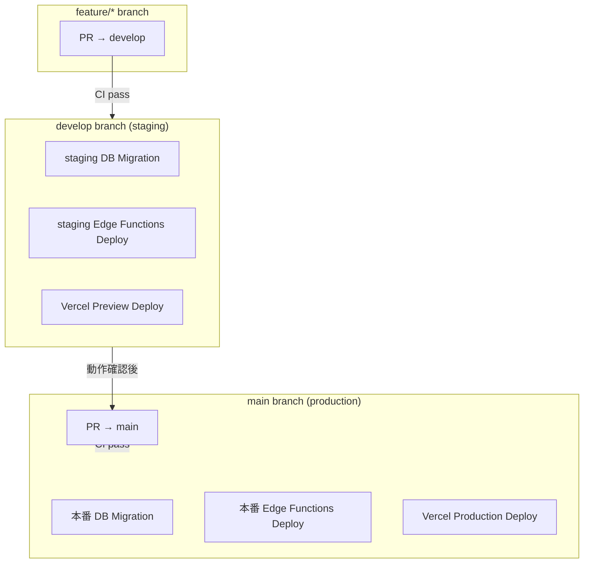
```mermaid
graph TB
    subgraph Feature["feature/* branch"]
        PR_Dev["PR → develop"]
    end

    subgraph Develop["develop branch (staging)"]
        StagingMig["staging DB Migration"]
        StagingFunc["staging Edge Functions Deploy"]
        StagingVercel["Vercel Preview Deploy"]
    end

    subgraph Main["main branch (production)"]
        PR_Main["PR → main"]
        ProdMig["本番 DB Migration"]
        ProdFunc["本番 Edge Functions Deploy"]
        ProdVercel["Vercel Production Deploy"]
    end

    PR_Dev -->|CI pass| Develop
    Develop -->|動作確認後| PR_Main
    PR_Main -->|CI pass| Main
```

### GitHub Actions ワークフロー

| ワークフロー | トリガー | 処理内容 |
|------------|---------|---------|
| `ci.yml` | PR → main / develop | Lint + Build + Functions Build |
| `test-migrations.yml` | PR (migrations変更時) | マイグレーションテスト |
| `supabase-migrate.yml` | Push → develop | staging DB マイグレーション |
| `supabase-migrate.yml` | Push → main | 本番 DB マイグレーション |
| `supabase-functions.yml` | Push → develop | staging Edge Functions デプロイ |
| `supabase-functions.yml` | Push → main | 本番 Edge Functions デプロイ |

### デプロイ先

| コンポーネント | Staging | Production | 方法 |
|--------------|---------|-----------|------|
| Next.js App | Vercel Preview | Vercel Production | Git 連携 (自動) |
| DB Migrations | staging Supabase | 本番 Supabase | GitHub Actions |
| Edge Functions | staging Supabase | 本番 Supabase | GitHub Actions |

> ディレクトリ構造の詳細は `CLAUDE.md` を参照
